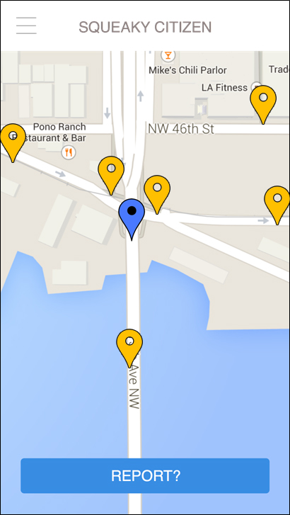
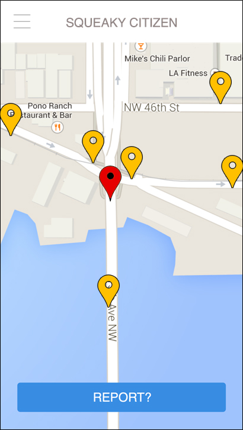

# Hack The Commute: Blind Spot

The purpose of this app is to provide an easy, quick, modern, open source, and multi-modal utility for crowd-sourcing input from citizens about everything from problem spots in their neighborhoods to possible improvements to incidents (minor crashes, near misses, etc).

This application was developed on March 20-22, 2015 for [Hack The Commute](https://codeforseattle.hackpad.com/Hack-the-Commute-2h8AsgMYcB8).

 Homescreen.

 Homescreen after crash is reported.

## Challenge and Approach

Problem: Cover the blind spots in Seattle's street safety data through crowdsourcing

Our approach for satisfying this challenge was to:

- Identify underreported incidents and other types of citizen input
- Design a more usable and quick user experience in contrast to existing solutions that includes these additional incidents
- Develop a completed open source stack from a cross-platform phone application down to a new data service

For the PowerPoint presentation, mock-up images, and other information, check out this Google Folder:
https://drive.google.com/a/cascadebicycleclub.org/file/d/0B1SDKU5iQGbQM3libUJVSUNISzQ/view?usp=sharing

## Team Members

Our team is comprised of:

- [@housepage](http://github.com/housepage) - Andrew Gall - Worked on the phone application prototype, Design
- [@alimon808](https://github.com/alimon808) - Adrian Limon - Backend Developer
- [@BrockRides](https://github.com/BrockRides) - Brock Howell - Stakeholder, Designer, Project Manager
- [@dilinger](https://github.com/dilinger) - Andres Solomon - Frontend Developer
- [@rohanaras](https://github.com/rohanaras) - Rohan Aras - Frontend Developer
- Graham Thompson - Stakeholder, Technical Adviser
- Selena Carsiotis - Stakeholder, Community Advocate

## Technologies, APIs, and Datasets Utilized

We made use of:

For the frontend:
- Apache Cordova
- AngularJS

For the backend:
- ASP.NET Web API for REST-ful APIs
- MSSQL Server
- Hosted on Azure

## Contributing

In order to build and run our app:

1. Install Apache Cordova
2. `npm install -g grunt-cli`
3. `npm install` - Install dependencies of build process
4. `grunt watch` - Compile all coffeescript into application.js
5. `cordova serve` - Serve files for viewing
6. Visit `http://localhost:8000/browser/www`

Our code is licensed under the [MIT License](LICENSE.md). Pull requests will be accepted to this repo, pending review and approval.
